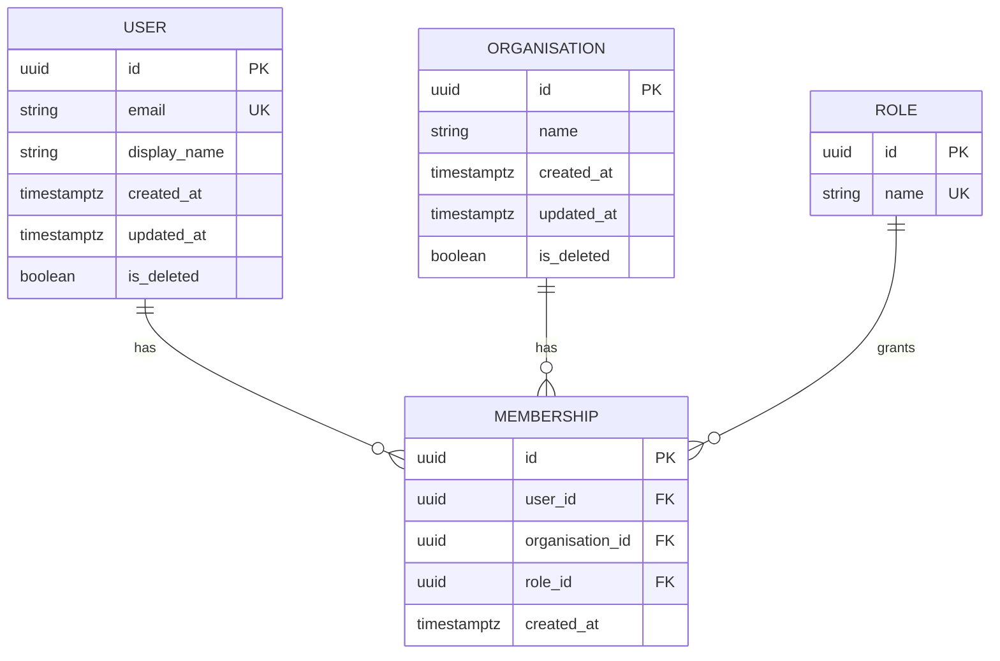

# Entity Relationship Diagram

> **Template.** Replace the diagram below with your own entities. Keep the file: three
> instruction files route database work here, and `npm run check:standards` requires it.

The single source of truth for the database schema. Read it before any work that touches
data models, migrations or relationships, and **update it in the same PR** whenever a
migration adds, removes or renames a table or column. A stale ERD is worse than no ERD:
it is read as current.

## Conventions these entities follow

Every table carries the audit and soft-delete columns the backend standards require
(`docs/standards/backend/auditing.md`). Tenant-scoped tables carry the organisation
foreign key that the global query filter reads
(`docs/standards/backend/multitenancy.md`).
