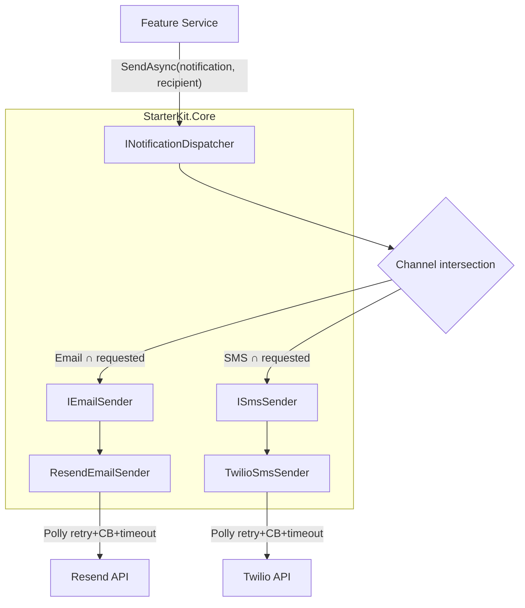

# Notification Standards

> **Applies to:** `StarterKit.Core`, `StarterKit.MobileApi`, `StarterKit.WebApi`

This document covers the email/SMS notification architecture, how to add new notifications,
testing strategy, and infrastructure references.

---

## Push Notification Inbox Policy

Push notifications split into two categories. **Classify every new type before choosing a delivery method.**

### Inbox notifications — persist in DB, appear in notification screen

Use `CreateAndDeliverAsync`. These have lasting value the user may want to reference or act on later.

| Type | Reason |
|---|---|
| `AdminMessage` | Explicitly addressed to the user; may require action |
| `NewContent` | Something they can revisit or engage with |
| `NewGame` | Actionable; remains relevant until played |
| `CalendarEventRsvpResetRequired` | An event's time changed and their RSVP was cleared — they still need to RSVP again, so it stays actionable until they do. |

### Transient notifications — OS push only, no DB row

Use `DeliverTransientAsync`. These are time-bound or in-app-redundant. Once the moment passes the notification has no meaning — persisting it only trains users to ignore badge counts.

| Type | Reason |
|---|---|
| `DailyPlayReminder` | Stale after that day |
| `WeeklyNudge` | Stale once the week ends |
| `StreakAtRisk` | Stale once the streak expires or they play |
| An in-app achievement | User already saw it via toast + tab badge |
| `NewMessage` | Chat messages persist in the Messages domain itself (`Message` rows + per-user unread cursors) — an inbox row per chat message would flood the notification drawer. Push is delivered via `DeliverTransientAsync` from `MessageDispatchJob` only when the recipient looks disconnected. |
| `CheckInReminder` | Stale the moment the slot's window closes — a missed Morning reminder has no meaning once Afternoon starts. Delivered via `DeliverTransientAsync` from `CheckInReminderJob`. |

### Adding a new push notification type

1. Add the value to `PushNotificationType` in `StarterKit.Data`.
2. Decide: does it have lasting value the user needs to read later? → inbox. Is it time-bound or redundant with in-app feedback? → transient.
3. Call the correct method — `CreateAndDeliverAsync` or `DeliverTransientAsync` — from the job or handler.
4. Add a row to the table above.

Never call `CreateAndDeliverAsync` for nudge/reminder types. The inbox exists to surface things that need attention; cluttering it with ephemeral nudges erodes trust in the badge count.

---

## Architecture



Key types:

| Type | Location | Purpose |
|---|---|---|
| `NotificationChannel` | `Notifications/Enums/` | `[Flags]` enum: `None`, `Email`, `Sms`, `All` |
| `Notification` | `Notifications/` | Abstract base — all concrete notifications extend this |
| `NotificationRecipient` | `Notifications/DTOs/` | `Email?` + `PhoneNumber?`; null field silently skips that channel |
| `INotificationDispatcher` | `Notifications/Interfaces/Services/` | Entry point for all sends |
| `NotificationDispatcher` | `Notifications/Services/` | Routes by channel intersection, sends concurrently |
| `IEmailSender` | `Notifications/Interfaces/Services/` | Single-message email abstraction |
| `ISmsSender` | `Notifications/Interfaces/Services/` | Single-message SMS abstraction |
| `ResendEmailSender` | `Notifications/Services/` | Resend implementation — renders embedded HTML templates locally, POSTs to `api.resend.com` |
| `EmailTemplateRenderer` | `Notifications/Services/` | Loads an embedded `Notifications/Templates/{Key}.html` file and substitutes `{{Property}}` placeholders |
| `TwilioSmsSender` | `Notifications/Services/` | Twilio implementation with test credentials |

---

## NotificationChannel Flags

```csharp
[Flags]
public enum NotificationChannel
{
    None  = 0,
    Email = 1,
    Sms   = 2,
    All   = Email | Sms,
}
```

At call-site, the `channels` parameter **narrows** which channels fire — it is intersected with
`notification.SupportedChannels`. If omitted, `notification.SupportedChannels` is used as-is.

```csharp
// Send both channels (uses notification.SupportedChannels = All)
await dispatcher.SendAsync(notification, recipient);

// Only send email even if the notification supports All
await dispatcher.SendAsync(notification, recipient, channels: NotificationChannel.Email);
```

---

## How to Add a New Notification

### Email-only

```csharp
// apps/backend/src/StarterKit.Core/<Feature>/Notifications/WelcomeEmail.cs
namespace StarterKit.Core.<Feature>.Notifications;

public sealed class WelcomeEmail : Notification
{
    public required string PlayerName { get; init; }
    public required string LoginUrl   { get; init; }

    public override NotificationChannel SupportedChannels => NotificationChannel.Email;

    public override EmailPayload BuildEmail() => new(
        Subject:      $"Welcome to StarterKit, {PlayerName}!",
        TemplateKey:  "WelcomeEmail",
        TemplateData: new { PlayerName, LoginUrl }
    );
}
```

### SMS-only

```csharp
// apps/backend/src/StarterKit.Core/<Feature>/Notifications/OtpSms.cs
namespace StarterKit.Core.<Feature>.Notifications;

public sealed class OtpSms : Notification
{
    public required string Code          { get; init; }
    public required int    ExpiryMinutes { get; init; }

    public override NotificationChannel SupportedChannels => NotificationChannel.Sms;

    public override SmsPayload BuildSms() => new(
        Body: $"Your StarterKit verification code is {Code}. It expires in {ExpiryMinutes} minutes."
    );
}
```

### Dual-channel (email + SMS)

```csharp
// apps/backend/src/StarterKit.Core/<Feature>/Notifications/GameInviteNotification.cs
namespace StarterKit.Core.<Feature>.Notifications;

public sealed class GameInviteNotification : Notification
{
    public required string InviterName { get; init; }
    public required string GameName    { get; init; }
    public required string InviteUrl   { get; init; }

    public override NotificationChannel SupportedChannels => NotificationChannel.All;

    public override EmailPayload BuildEmail() => new(
        Subject:      $"{InviterName} invited you to {GameName}",
        TemplateKey:  "GameInviteNotification",
        TemplateData: new { InviterName, GameName, InviteUrl }
    );

    public override SmsPayload BuildSms() => new(
        Body: $"{InviterName} invited you to {GameName}. Join here: {InviteUrl}"
    );
}
```

### Dispatch from a service

```csharp
// Inject INotificationDispatcher via constructor
await _dispatcher.SendAsync(
    new WelcomeEmail { PlayerName = user.Name, LoginUrl = loginUrl },
    new NotificationRecipient(Email: user.Email, PhoneNumber: null)
);
```

---

## Embedded Email Templates

Resend has no hosted, dashboard-configured template concept — templates are plain HTML files
embedded into `StarterKit.Core` and rendered locally before the request is sent.

1. Add a constant for the template key to `EmailTemplateKeys`.
2. Add `Notifications/Templates/{Key}.html` — it's picked up automatically by the
   `<EmbeddedResource Include="Notifications\Templates\*.html" />` glob in `StarterKit.Core.csproj`.
3. Use `{{PropertyName}}` placeholders in the HTML matching the public properties of the
   `TemplateData` object passed on `EmailPayload`.
4. `EmailTemplateRenderer.Render(templateKey, templateData)` loads the resource and substitutes
   placeholders via reflection; unresolved placeholders are left as-is (fail loudly, don't be
   silently swallowed).
5. Always set `EmailPayload.Subject` explicitly — Resend has no template-level subject to fall
   back on.

---

## Configuration

### Options classes

| Class | Config section | Required fields |
|---|---|---|
| `EmailOptions` | `Email` | `ApiKey`, `FromEmail`, `FromName` |
| `TwilioOptions` | `Twilio` | `AccountSid`, `AuthToken`, `FromNumber` |

Both classes use `ValidateDataAnnotations()` + `ValidateOnStart()` — misconfiguration fails fast
at startup, not silently at runtime.

### Dev/test email delivery

Resend has no sandbox mode. Set `Email:Enabled=false` in dev/test — `NoOpSetupEmailService` logs
the link instead of sending, and (for admin-created users) the WebApi returns the raw setup link
in the response body so it can be tested without sending real email.

### Twilio test credentials

Set `Twilio__UseTestCredentials=true` in dev/UAT and provide `Twilio__TestAccountSid`,
`Twilio__TestAuthToken`, `Twilio__TestFromNumber` to use [Twilio's Magic Numbers](https://www.twilio.com/docs/iam/test-credentials).

---

## Key Vault Secrets

| Secret name | Used in |
|---|---|
| `Email--Enabled` | `EmailOptions.Enabled` |
| `Email--ApiKey` | `EmailOptions.ApiKey` |
| `Email--FromEmail` | `EmailOptions.FromEmail` |
| `Twilio--AccountSid` | `TwilioOptions.AccountSid` |
| `Twilio--AuthToken` | `TwilioOptions.AuthToken` |
| `Twilio--FromNumber` | `TwilioOptions.FromNumber` |
| `Twilio--TestAccountSid` | `TwilioOptions.TestAccountSid` (dev/UAT only) |
| `Twilio--TestAuthToken` | `TwilioOptions.TestAuthToken` (dev/UAT only) |
| `Twilio--TestFromNumber` | `TwilioOptions.TestFromNumber` (dev/UAT only) |

Key Vault: `kv-starterkit-dev` (dev + UAT), `kv-starterkit-prod` (prod).

> **Important:** Each Key Vault secret name uses `--` as the hierarchy separator (e.g. `Email--ApiKey` → `Email:ApiKey`). Do NOT create environment-specific key names like `Email--Dev--ApiKey` — those would bind to a nested property that does not exist in `EmailOptions`. Use separate Key Vaults per environment (`kv-starterkit-dev` / `kv-starterkit-prod`) with the same secret names. The section stays provider-neutral (`Email`) so switching providers never requires renaming secrets.
>
> **`Email--FromName` is intentionally not a Key Vault secret** — it's not sensitive data. It falls back to the `"StarterKit"` default committed in `appsettings.json`. Only add it to Key Vault if an environment genuinely needs a different display name.

### Deploy pipeline must never set `Email__*` as an App Service app setting

`Program.cs` registers `AddEnvironmentVariables()` **after** `AddAzureKeyVault(...)` (so local `docker-compose` overrides can pin values without disabling Key Vault). This means an Azure App Service application setting for any `Email__*` key will **always** shadow the matching Key Vault secret, regardless of the value — including placeholder values like `"#"` or `"dev-noop"`, which have no special runtime meaning to `Microsoft.Extensions.Configuration`.

`deploy-backend-azure-dev.yml` and `deploy-webapi-azure-dev.yml` used to set dummy `Email__Enabled` / `Email__ApiKey` / `Email__FromEmail` / `Email__FromName` app settings on every deploy — this permanently overrode any real secrets added to `kv-starterkit-dev`, and since `az webapp config appsettings set` never removes a key it doesn't mention, a manual fix never survived the next deploy. Both dev workflows now run an explicit `az webapp config appsettings delete` step for those four keys before the "Ensure runtime app settings" step, and never set them again — Key Vault is the sole, permanent source for `Email:ApiKey` / `Email:Enabled` / `Email:FromEmail` on every environment (matching how UAT already worked). Do not reintroduce `Email__*` as an app setting in any deploy workflow.

---

## Infrastructure

| Resource | Scope |
|---|---|
| Resend account + API key ([resend.com](https://resend.com)) | Shared across envs — `Email--ApiKey` differs per Key Vault |
| Twilio account | All envs |

---

## Resilience (Polly)

Both pipelines (`notifications-email`, `notifications-sms`) are configured in
`NotificationsServiceCollectionExtensions` with:

- **Retry:** 3 attempts, 300 ms base delay, exponential back-off with jitter
- **Circuit breaker:** 50% failure ratio over 30 s window, min 5 requests, 15 s break
- **Timeout:** 15 s per attempt

---

## Testing Strategy

### Unit tests

Each notification test file lives in `apps/backend/tests/StarterKit.Core.Tests/Notifications/`.

**Senders** (`ResendEmailSenderTests`, `TwilioSmsSenderTests`):

- Inject `ResiliencePipeline.Empty` via a mocked `ResiliencePipelineProvider<string>` to bypass Polly in unit tests.
- `ResendEmailSenderTests` swaps in a fake `HttpMessageHandler` to assert on the outgoing request instead of mocking a client type; `TwilioSmsSenderTests` mocks `ITwilioRestClient`.
- Verify happy path, from-address overrides/test-credentials mode, and error-status throws.

**Dispatcher** (`NotificationDispatcherTests`):

- Use private stub notifications (email-only, SMS-only, dual-channel).
- Cover all channel intersection scenarios and null-recipient field skips.

**Example notifications** (`ExampleNotificationsTests`):

- Assert `SupportedChannels`, payload content, and that opposite-channel `Build*()` returns null.

### Integration smoke test

Set `Email:Enabled=false` and use Twilio test credentials in the integration environment. No
live email is sent (the NoOp setup email service logs/returns the link instead); Twilio accepts
but doesn't deliver.
