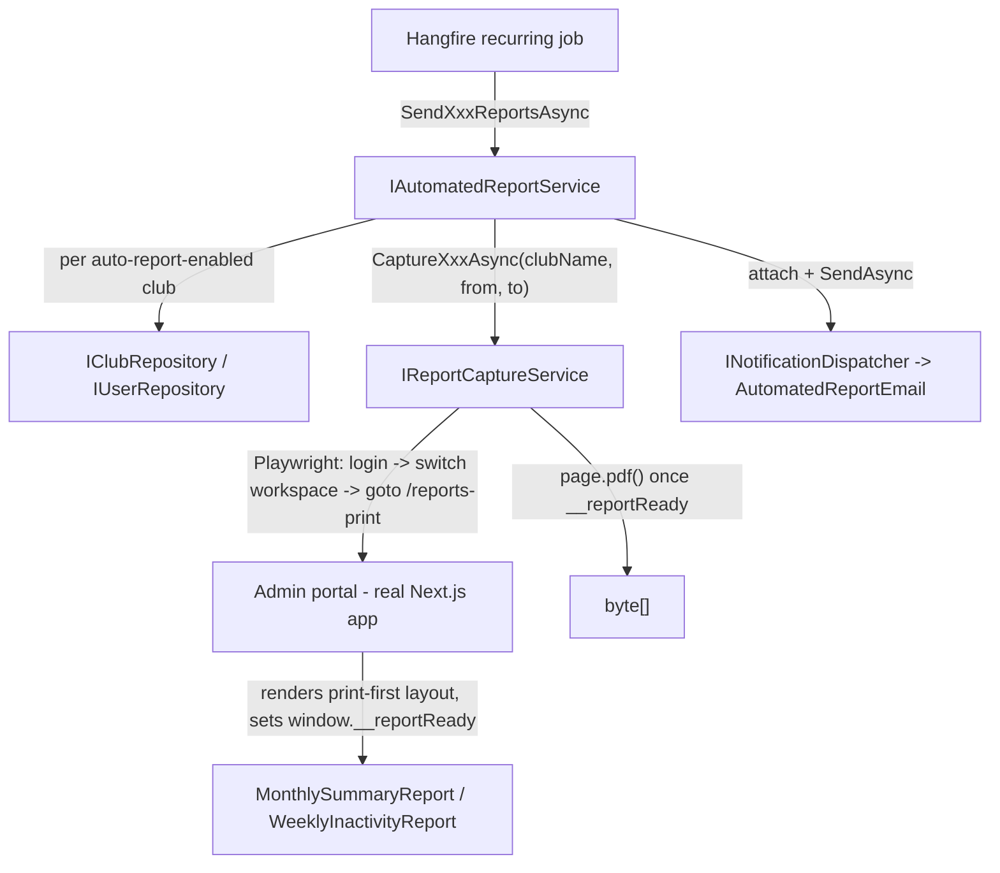

# PDF Report Generation — The Law

Load this file when: adding a new automated/printable PDF report, modifying the Playwright
capture pipeline, or touching the print-only report layouts under
`apps/web/src/features/reports/presentation/print/`.

---

## Overview — browser-driven capture, not a PDF library

StarterKit does **not** render PDFs with a PDF-generation library — no QuestPDF, no wkhtmltopdf, no
server-side HTML templating. Instead it drives the **real admin portal** with headless Chromium
(Playwright) and lets Chromium's native print-to-PDF do the rendering. A report is just another
Next.js page — a chromeless, print-only layout that reuses the reports feature's existing data
hooks/components — captured to a vector PDF (real text + SVG charts, not a screenshot).

**Consequence for future work:** adding a new PDF report means building a normal React page in the
print-first layout system, not standing up a new PDF templating stack.

---

## Architecture



## Key types

| Type | Location | Purpose |
|---|---|---|
| `IReportCaptureService` | `StarterKit.Core/Reports/Interfaces/Services/` | Contract: `Capture<Report>Async(clubName, from, to, ct) → Task<byte[]>`, plus `CaptureDashboardExportAsync(clubName, reportParam, from, to, ct)` for on-demand exports |
| `PlaywrightReportCaptureService` | `StarterKit.WebApi/Reports/Services/` | The only implementation. Lives in `StarterKit.WebApi`, not `StarterKit.Core`, so the Playwright/browser dependency never leaks into Core |
| `ReportCaptureOptions` | `StarterKit.Core/Reports/Options/` | Bound from `Reports:Capture` — `PortalBaseUrl`, `ServiceAccountEmail`/`ServiceAccountPassword` (SuperAdmin login), `CaptureTimeoutSeconds`, `DevBlobStorageHost` |
| `IAutomatedReportService` / `AutomatedReportService` | `StarterKit.Core/Reports/Interfaces/Services/` and `Services/` | Orchestrates: enabled clubs → eligible recipients → capture → email, per report cadence |
| `AutomatedReportEmail` | `StarterKit.Core/Reports/Notifications/` | `Notification` subtype that attaches the PDF bytes to an email — see `docs/standards/notifications.md` |
| `MonthlyAutoReportJob` / `WeeklyPlayerInactivityReportJob` | `StarterKit.Core/Reports/Jobs/` | Hangfire recurring jobs, scheduled via `recurringJobs.AddOrUpdate` in `Program.cs` |
| `IDashboardPdfExportProcessor` / `DashboardPdfExportProcessor` | `StarterKit.Core/Reports/Interfaces/Services/` and `Services/` | Queued (not scheduled) job for the on-demand "Export to PDF" menu — see the section below |
| `ReportController.QueueDashboardPdfExport` / `GetDashboardPdfDownloadUrlAsync` | `StarterKit.WebApi/Reports/ReportController.cs` | `POST /api/reports/export/pdf/queue` / `GET /api/reports/export/pdf/download/{exportId}` |
| `ReportsPrintPage` | `apps/web/src/features/reports/presentation/pages/reports-print-page.tsx` | The chromeless `/reports-print` route Playwright navigates to |
| `MonthlySummaryReport` / `WeeklyInactivityReport` | `apps/web/src/features/reports/presentation/print/` | The automated report print-first document layouts |
| `<Section>SectionReport` / `<Section>SectionContent` / `FullDashboardReport` | `apps/web/src/features/reports/presentation/print/` | The on-demand dashboard export print-first layouts (ABC-123) |
| `ReportPrintTheme` | `apps/web/src/features/reports/presentation/print/report-print-theme.tsx` | The single source of print CSS — co-branding, page-break rules, type scale |
| `print-format.ts` | `apps/web/src/features/reports/lib/print-format.ts` | Pure, locale-aware date formatters for report text |

---

## The capture pipeline (`PlaywrightReportCaptureService`)

1. Launch headless Chromium (`--no-sandbox --disable-dev-shm-usage` — required in the non-root container, whose small `/dev/shm` can't support the sandbox).
2. Sign in via the real `/login` form as a **SuperAdmin service account** — never a per-user session. The job runs club-agnostic and needs to switch workspace freely.
3. Use the workspace switcher (`club-selector` / `club-flyout` test ids — the same pattern E2E tests use) to select the target club.
4. Navigate to `/reports-print?report=<kind>&from=yyyy-MM-dd&to=yyyy-MM-dd`.
5. Poll `window.__reportReady === true` (set by `ReportsPrintPage`).
6. `page.pdf({ Format: "A4", Landscape: true, PrintBackground: true, ... })` — full-bleed left/right/top margins, 32px bottom margin reserved for the footer.
7. The footer (`BuildFooterTemplate`) is injected by **Chromium itself**, not the React page: `{Club} · Confidential | Powered by StarterKit | Page x of y`.

Nothing in this pipeline should be reimplemented per report. A new report only needs a new
`reportParam` value and a new print layout component — login, workspace switch, the readiness
wait, and the print call are all shared via the private `CaptureAsync(...)` helper.

## How the frontend signals "ready to print"

`ReportsPrintPage` sets `window.__reportReady = true` only after:

- `clubId` has resolved (the workspace/session lookup is async and invisible to `queryClient.isFetching`)
- `queryClient.isFetching({ queryKey: ['reports'] })` has been `0` for `idleStableMs`
- two `requestAnimationFrame`s plus `chartPaintSettleMs` have elapsed, giving DevExtreme charts a frame to finish their initial paint

all capped by `maxWaitMs` so a stuck report can't hang the capture forever. Timings live in
`uiConfig.reports.printCapture`.

**Any new print report must go through this same readiness gate.** If a new report's data hooks
don't use the `['reports']` query key namespace, `PlaywrightReportCaptureService` will print
before the data has loaded — this was the original cause of the "all zero" report bug tracked
under ABC-123.

## Localization

Report PDFs render in whatever locale the service account's admin session is using — never a
hardcoded locale. All date formatting for print reports goes through
`apps/web/src/features/reports/lib/print-format.ts`:

| Function | Output |
|---|---|
| `formatDayMonth(dateStr, locale)` | `"23 Jun"` |
| `formatDayMonthYear(dateStr, locale)` | `"29 Jun 2026"` |
| `formatGeneratedOnDate(locale)` | Current date, for the cover's "Generated on" stamp |
| `formatWeekPeriod(from, to, locale)` | `"23 Jun – 29 Jun 2026"` |
| `formatMonthYear(dateStr, locale)` | `"June 2026"` |
| `formatMonthShort(dateStr, locale)` | `"Jun"` |

Every formatter accepts an optional `locale` (default `DEFAULT_LOCALE`); report components pass
`i18n.language` (from `useTranslation('reports')`) through to every call.

**Never call `Intl.DateTimeFormat` / `toLocaleDateString` directly in a print report component —
always go through `print-format.ts`**, so a report captured for a non-default-locale admin
session still prints correctly formatted dates.

## Print CSS / theming

`ReportPrintTheme` is the single source of print CSS, injected once at the root of every print
report. It owns:

- Co-branding — `--rp-navy` derives from the club's own brand colour (clamped for contrast); `--rp-gold` is a fixed StarterKit accent, never derived from the club
- Page-break control (`break-before: page`, `break-inside: avoid-page`, `box-decoration-break: clone` for boxes whose padding must reappear on every fragment)
- A fixed 8px spacing rhythm and a small, closed type scale
- `@page { size: A4 landscape; margin: 0; }` — must stay in sync with `Landscape` in `PagePdfOptions` on the backend

A new print report should compose the existing `.rp-*` classes and building-block components
(`print-cover.tsx`, `print-kpi-strip.tsx`, `print-table.tsx`, `print-bar-chart.tsx`,
`print-line-chart.tsx`, `print-grouped-bar-chart.tsx`, `print-severity-tiles.tsx`,
`print-podium.tsx`, `print-narrative.tsx`, `print-section.tsx`) rather than inventing new print
CSS from scratch.

---

## On-demand dashboard export (ABC-123)

The reports toolbar's "Export to PDF" menu (current section / entire dashboard) goes through the
**same** `IReportCaptureService` / `/reports-print` pipeline as the automated reports — it is not a
client-side DOM screenshot. The differences from the automated flow:

```mermaid
flowchart TD
    UI[Reports toolbar "Export to PDF"] -->|"POST /api/reports/export/pdf/queue"| Ctl[ReportController]
    Ctl -->|Enqueue| Job[DashboardPdfExportProcessor]
    Job -->|"CaptureDashboardExportAsync(clubName, reportParam, from, to)"| Cap[IReportCaptureService]
    Cap -->|"same login -> workspace switch -> /reports-print -> page.pdf()"| Portal[Admin portal]
    Job -->|Upload| Blob["Azure Blob (report-exports container)"]
    Job -->|BroadcastExportReadyAsync| Hub[SignalR AdminRealtimeHub]
    Hub -->|onExportReady| UI
```

- **Requester-driven, not scheduled.** The admin's own browser queues the job (`useExportReports`
  → `reportDatasource.queueDashboardPdfExport`); there's no Hangfire recurring schedule.
- **`reportParam` is caller-supplied**, one of `section-summary`, `section-players`,
  `section-games`, `section-teams`, `section-gamification`, or `full-dashboard` — validated
  against `ReportController.DashboardPdfReportKinds`, which must stay in sync with
  `ReportsPrintPage`'s allow-list and the frontend's `reportParamForTab`.
- **Layouts are dashboard-section print components** (`SummarySectionReport`,
  `PlayersSectionReport`, `GamesSectionReport`, `TeamsSectionReport`,
  `GamificationSectionReport`, `FullDashboardReport`) under
  `apps/web/src/features/reports/presentation/print/`, built the same way as
  `MonthlySummaryReport` (one `PrintCover` + `PrintSection` blocks). Each section's cover-plus-content
  component (`*SectionReport`) composes a content-only component (`*SectionContent`) so
  `FullDashboardReport` can render all five contents after a single shared cover without
  duplicating any section's markup.
- **Delivery mirrors the queued full-dashboard xlsx export**, not the email flow:
  `DashboardPdfExportProcessor` (implements `IDashboardPdfExportProcessor`, mirrors
  `FullDashboardExportProcessor`) uploads to the same `BlobContainerName.ReportExports` container
  and pushes the same `IReportExportBroadcaster` `ReceiveExportReadyAsync`/`ReceiveExportFailedAsync`
  SignalR events — the frontend's existing `useAdminRealtimeHub` handling needs no PDF-specific
  branch.
- **No email attachment, no automated schedule, no `AutomatedReportEmail`** — this path never
  touches `IAutomatedReportService`.

### Adding a new dashboard section to the export menu

1. Build `<Section>SectionContent` (the `PrintSection pageBreak` blocks, reusing the section's
   existing `['reports']`-scoped data hooks) and `<Section>SectionReport` (a `PrintCover` + the
   content component) under `presentation/print/`.
2. Add the content component to `FullDashboardReport`'s render list.
3. Add the new `report` param value to both `ReportController.DashboardPdfReportKinds` (backend)
   and `ReportsPrintPage`'s allow-list (frontend) — keep the two lists identical.
4. Barrel-export the new components from `presentation/print/index.ts`.

---

## Adding a new PDF report

1. **Frontend print layout** — under `apps/web/src/features/reports/presentation/print/`, build a new component from the existing `print-*.tsx` building blocks and `ReportPrintTheme`. Localize every date via `print-format.ts`.
2. **Wire the print route** — add your `report` param value to `ReportsPrintPage`'s allow-list and render the new component. Keep your data hooks under the `['reports']` query key so the existing readiness gate covers you — don't invent a second readiness signal.
3. **Backend capture method** — add `Capture<YourReport>Async(clubName, from, to, ct)` to `IReportCaptureService` and implement it in `PlaywrightReportCaptureService` as a one-line call to the shared private `CaptureAsync(...)` with your new `reportParam`.
4. **Orchestration method** — add `Send<YourReport>ReportsAsync(from, to, ct)` to `IAutomatedReportService` / `AutomatedReportService`, calling the shared `SendReportsAsync(...)` pipeline with your capture delegate, attachment title, period label, and file name.
5. **Email template** — reuse `AutomatedReportEmail` if "PDF attached to an email with a period label" already fits; only add a new `EmailTemplateKeys` entry if the email content genuinely differs (see `docs/standards/notifications.md`).
6. **Hangfire job** — add a job in `StarterKit.Core/Reports/Jobs/` following `MonthlyAutoReportJob` / `WeeklyPlayerInactivityReportJob`: compute the period, call your new `Send...ReportsAsync`, mark it `[AutomaticRetry(Attempts = 0)]`, accept `IJobCancellationToken` (see `docs/standards/backend/jobs.md`). Register it `Scoped` and schedule it with `recurringJobs.AddOrUpdate<...>` in `Program.cs`, in the same **WebApi-only** DI block as the existing report services.
7. Do **not** build a one-off PDF pipeline (a separate headless-browser launch, a PDF library, server-side HTML templating) for a new report — every report should flow through `IReportCaptureService` / `IAutomatedReportService`.

---

## Gotchas

- **WebApi-only.** `IReportCaptureService`, `IAutomatedReportService`, both automated jobs, and `IDashboardPdfExportProcessor` are registered only in `StarterKit.WebApi`'s `Program.cs`. `StarterKit.MobileApi` has no Chromium binaries and would fail `ValidateOnStart` DI validation if these were referenced there. `FullDashboardExportProcessor` (the xlsx equivalent) has no such dependency and is registered in the shared `StarterKit.Core` `ServiceCollectionExtensions` instead — don't move `DashboardPdfExportProcessor` there.
- **Service account must be SuperAdmin.** The capture browser signs in once and switches workspace per club; a non-SuperAdmin account can't reach every club.
- **`window.__reportReady` is the only sync point.** A report whose data doesn't settle inside `['reports']`-scoped queries, or whose charts paint outside the settle window, will be captured empty or half-rendered.
- **`DevBlobStorageHost` is a local-dev-only rewrite.** It exists because the capture browser runs *inside* the webapi container, where `localhost` doesn't reach the host-forwarded Azurite port a real browser would reach. Leave it unset outside docker-compose dev — production blob URLs never match the rewrite, so it's a no-op everywhere else.
- **One club's failure doesn't abort the batch.** `AutomatedReportService.SendReportsAsync` catches and logs per club; check logs for `AutomatedReportService: failed to send {ReportKind} report for club {ClubId}` rather than assuming a Hangfire failure means every club failed.

---

## Related docs

- `docs/standards/notifications.md` — the `Notification` / `INotificationDispatcher` pattern `AutomatedReportEmail` uses to attach and send the PDF
- `docs/standards/backend/jobs.md` — general Hangfire job conventions
- `docs/standards/reporting.md` — the underlying reporting *data* domain (snapshot tables) the report queries read from
- `docs/standards/frontend-web.md` — general web app conventions; print layouts intentionally use plain scoped CSS instead of Tailwind (see `ReportPrintTheme`'s doc comment for why)
