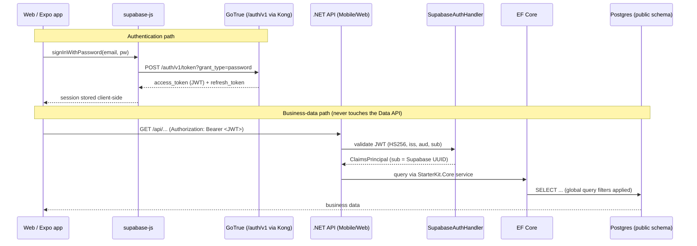

# Supabase — The Law

Supabase provides **authentication and Postgres** for StarterKit. GoTrue issues and refreshes JWTs;
our own .NET APIs own every byte of business data. This file governs the container stack, the JWT
contract, the `app_metadata` authorization law, where each concern lives, and the secret
inventory. Read it before touching anything under `infra/supabase/`, `StarterKit.Auth`, or the
`@supabase/supabase-js` client in `packages/shared`.

**Two deployment shapes, one contract:**

| Where | Supabase | Why |
|---|---|---|
| **Local dev machines** | Self-hosted docker stack (`infra/supabase/`) — isolated per machine, committed demo secrets, no cloud creds | Every dev migrates/tests against their own DB; in-progress migrations never hit shared data |
| **Deployed environments** (dev/uat/prod portal + APIs) | **Hosted** Supabase project (dev: "StarterKit Dev", `https://YOUR-PROJECT-REF.supabase.co`) | Managed auth + DB for the live environment; secrets in Key Vault (see § Deployed environments) |

---

## Overview — what we run and what we don't

We run a **slimmed** self-hosted Supabase stack. Supabase ships a large `docker-compose.yml`
(PostgREST, Realtime, Storage, Edge Functions, Studio, imgproxy, analytics…). We run the
minimum required to authenticate users and store data, and nothing else.

| Container | Image | Role | Exposed via Kong |
|---|---|---|---|
| `db` | `supabase/postgres` | Postgres 15+ with `pgvector` bundled. Holds **both** schemas: `public` (owned by EF Core) and `auth` (owned by GoTrue). | No — internal only |
| `auth` | GoTrue | Issues/refreshes/validates JWTs, manages `auth.users`, sign-up/sign-in, password reset, the service-role Admin API. | `/auth/v1/*` only |
| `kong` | Kong gateway | API gateway. Exposes **only** `/auth/v1/*`. Every other route (`/rest/v1`, `/realtime/v1`, `/storage/v1`, `/functions/v1`) is **not** routed. | — (is the gateway) |

### Omitted — and why

| Omitted service | Why we don't run it |
|---|---|
| **PostgREST** (`/rest/v1`) | This is Supabase's auto-generated Data API. We expose **zero** business data through it. All data access goes through our own .NET endpoints, which enforce RBAC and tenant isolation. Shipping PostgREST would create a second, unguarded door into `public`. |
| **Realtime** | We already run SignalR (`docs/standards/signalr.md`) for real-time. Two real-time stacks is redundant. |
| **Storage** | Media/blob storage is handled by our existing Blob provider (`docs/standards/backend/patterns.md`). |
| **Edge Functions** | Business logic lives in `StarterKit.Core`. We do not run untyped serverless functions. |
| **Studio (in prod)** | The admin UI is a large attack surface. Use it locally against the dev DB only; never expose it in a deployed environment. |

> **The stack is auth infrastructure, not a backend.** If a task wants to "just query Supabase
> directly for data," that is a violation — it goes through a .NET endpoint.

---

## Auth flow

Two independent paths. Auth talks to GoTrue directly; data always goes through .NET.



**Invariant:** the apps call GoTrue **only** for auth (login, register, refresh, logout, password
reset) — mirroring how the old Firebase Auth client worked. Every business read/write goes to a
.NET endpoint with the GoTrue JWT as a `Bearer` token. **We never call the auto-generated Data API
(PostgREST).**

---

## The JWT contract the backend validates

GoTrue signs access tokens with **HS256** using the shared `JWT_SECRET`. `SupabaseAuthHandler`
(in `StarterKit.Auth`) validates every incoming `Bearer` token against this contract:

| Claim / parameter | Value | Notes |
|---|---|---|
| Algorithm | `HS256` | Symmetric — the same `JWT_SECRET` signs and validates. |
| `iss` (issuer) | `${API_EXTERNAL_URL}/auth/v1` | e.g. `http://localhost:8000/auth/v1` locally. Must match exactly. |
| `aud` (audience) | `authenticated` | GoTrue's audience for signed-in users. |
| `sub` (subject) | user UUID | The `auth.users.id` — stored in `UserEntity.ExternalAuthId`. |
| `exp` / `iat` | standard | Validated with clock-skew tolerance. |
| `app_metadata` | authz payload | `company_id` and any authorization data live here (see next section). |

```csharp
// ✅ CORRECT — SupabaseAuthHandler validates against the GoTrue contract
var validationParameters = new TokenValidationParameters
{
    ValidateIssuer = true,
    ValidIssuer = $"{options.ApiExternalUrl}/auth/v1", // e.g. http://localhost:8000/auth/v1
    ValidateAudience = true,
    ValidAudience = "authenticated",
    ValidateIssuerSigningKey = true,
    IssuerSigningKey = new SymmetricSecurityKey(Encoding.UTF8.GetBytes(options.JwtSecret)), // HS256
    ValidateLifetime = true,
};

// ❌ VIOLATION: skipping issuer/audience validation accepts tokens from any GoTrue instance
new TokenValidationParameters { ValidateIssuer = false, ValidateAudience = false };
```

> **Hosted projects sign with ES256, not HS256.** The hosted Supabase platform issues user tokens
> signed with an asymmetric key (JWKS, keyed by `kid`). `SupabaseAuthService` therefore resolves
> signing keys from the issuer's OIDC discovery document (cached, auto-rotating) **and** accepts
> the shared HS256 secret — so the same backend validates local self-hosted tokens (HS256 demo
> secret) and hosted tokens (ES256) with no config switch. Algorithms are restricted to
> ES256/RS256/HS256; issuer/audience/lifetime are always enforced.

### `ExternalAuthId` maps to `sub`

`UserEntity.ExternalAuthId` stores the Supabase `sub` UUID. On every authenticated request the
`RoleClaimsTransformer` resolves the internal user, roles, and tenant from `ExternalAuthId`
(the pre-registration + email-fallback model is unchanged from the Firebase era — only the source
of the external id changed).

```csharp
// ✅ CORRECT — resolve the internal user from the Supabase sub
var sub = principal.FindFirstValue(ClaimTypes.NameIdentifier); // GoTrue "sub"
var user = await userRepository.FindByExternalAuthIdAsync(sub, ct);

// ❌ VIOLATION: trusting the email claim as the primary key — email can change; sub is stable
var user = await userRepository.FindByEmailAsync(principal.FindFirstValue(ClaimTypes.Email), ct);
// (email is only the pre-registration fallback, never the primary lookup)
```

---

## The `app_metadata` vs `user_metadata` law

This is the security invariant that replaces Firebase custom claims.

- **`app_metadata`** — set **server-side only** via the service-role Admin API. Users **cannot**
  edit it. It appears in the signed JWT. **All authorization data (`company_id`, and anything the
  backend trusts for access decisions) MUST live here.**
- **`user_metadata`** — user-editable (a signed-in user can write it through the client SDK).
  It is **never** trusted for authorization — treat it as untrusted display preferences only.

```csharp
// ✅ CORRECT — set company_id in app_metadata via the service-role Admin API (server-only)
await supabaseAdmin.UpdateUserByIdAsync(userId, new AdminUserAttributes
{
    AppMetadata = new Dictionary<string, object> { ["company_id"] = companyId.ToString() },
});
// ↑ requires SERVICE_ROLE_KEY — runs in StarterKit.Core/StarterKit.Auth, never on a client
```

```ts
// ❌ VIOLATION: writing authorization data to user_metadata from the client
await supabase.auth.updateUser({ data: { company_id: someCompanyId } });
// ↑ this lands in user_metadata, which the user controls — a tenant-escalation hole
```

```csharp
// ❌ VIOLATION: backend trusting user_metadata for an access decision
var companyId = jwt.GetClaim("user_metadata")?["company_id"]; // user-forgeable — never
```

**Rule:** if the backend reads a claim to make an authorization decision, that claim must have
originated in `app_metadata`, written by the service role. No exceptions.

---

## Where each concern lives (separation of concerns)

| Concern | Location | Responsibility |
|---|---|---|
| Containers, compose, secrets | `infra/supabase/` | `docker-compose.supabase.yml`, `.env` / `.env.example`, `volumes/`, `README.md`. The only place container config and secrets live. |
| JWT validation | `StarterKit.Auth` → `SupabaseAuthHandler` | Validates the GoTrue JWT against the contract above; builds the `ClaimsPrincipal`. |
| Auth options | `StarterKit.Auth` → `SupabaseOptions` | Binds `JWT_SECRET`, `API_EXTERNAL_URL`, audience via the Options pattern. |
| Admin / provisioning | `StarterKit.Auth` (auth provider / admin service) | Uses the **service-role** key to set `app_metadata` (`company_id`), create/invite users. Server-only. |
| Claims → internal user | `StarterKit.Auth` → `RoleClaimsTransformer` | Resolves `UserEntity` / roles / tenant from `ExternalAuthId` (= `sub`). |
| Client auth SDK | `packages/shared` (supabase-js datasource) | `@supabase/supabase-js` for login/register/refresh/logout only. Uses the **anon** key. |
| Business data | .NET APIs → `StarterKit.Core` → `StarterKit.Data` → Postgres | **Always.** Never PostgREST, never a direct client-to-Postgres query. |

The Postgres instance is **consolidated**: EF Core owns and migrates the `public` schema; GoTrue
owns the `auth` schema (including `auth.users`). Connection string:
`Host=db;Database=postgres;Username=postgres`.

```csharp
// ❌ VIOLATION: EF Core migrations touching the auth schema — GoTrue owns it
migrationBuilder.CreateTable(name: "users", schema: "auth", ...);

// ❌ VIOLATION: a datasource calling PostgREST for business data
await supabase.from('companies').select('*'); // ← there is no Data API; use the .NET endpoint
```

---

## Secret inventory

Secrets live in `infra/supabase/.env` (git-ignored) with placeholders in
`infra/supabase/.env.example`. See `infra/supabase/README.md` for the generation commands.

| Secret | Used by | Client-safe? | Notes |
|---|---|---|---|
| `JWT_SECRET` | GoTrue (sign) + `SupabaseAuthHandler` (validate) | **No** | The HS256 signing key. Server-only. Rotating it invalidates all tokens. |
| `ANON_KEY` (a.k.a. publishable key) | supabase-js on web + Expo | **Yes** | Public by design; identifies the project to GoTrue. Confers no privileged access on its own. |
| `SERVICE_ROLE_KEY` (a.k.a. secret key) | Admin API in `StarterKit.Auth` | **No — never ship to clients** | Bypasses RLS and can set `app_metadata`. Server-only; leaking it is a full compromise. |
| `POSTGRES_PASSWORD` | `db`, GoTrue, EF Core connection string | **No** | Postgres superuser password. |
| `API_EXTERNAL_URL` | GoTrue issuer + backend `ValidIssuer` | n/a (config) | e.g. `http://localhost:8000`. The issuer is `${API_EXTERNAL_URL}/auth/v1`. |
| `SITE_URL` | GoTrue | n/a (config) | Base URL for email confirmation / password-reset redirect links. |

> **The committed values in `.env.example` are public demo secrets.** They exist only so
> `npm run dev:backend` boots on a fresh clone. **Regenerate every secret for any non-local
> environment** (staging, prod). Never reuse a demo `JWT_SECRET` or `SERVICE_ROLE_KEY` outside
> a developer's machine.

```ts
// ✅ CORRECT — client uses the anon/publishable key only
const supabase = createClient(SUPABASE_URL, SUPABASE_ANON_KEY);

// ❌ VIOLATION: service_role key in any client bundle (web or Expo)
const supabase = createClient(SUPABASE_URL, SUPABASE_SERVICE_ROLE_KEY); // full DB compromise
```

---

## RLS stance — defense-in-depth, automated

Enable **Row Level Security on every `public` table** — locally PostgREST isn't even routed, but
on the **hosted** project the Data API endpoint exists at the platform level, so RLS is what stops
the anon key from reading business data if a dashboard toggle is ever wrong.

- **Primary tenant isolation** is our .NET layer: RBAC policies (`docs/standards/nfr-security.md`)
  - EF Core **global query filters** (`docs/standards/backend/multitenancy.md`). This is what
  actually enforces one company never seeing another's data.
- **RLS is deny-by-default with no policies**: PostgREST's `anon`/`authenticated` roles read
  nothing, while EF Core connects as the table **owner** and is not blocked.
- **This is automated** — the migrator enables RLS on every `public` table on each run
  (`StarterKit.Migrator/Program.cs`), so new tables are covered in every environment without manual
  steps.

```sql
-- ✅ CORRECT — ENABLE (not FORCE). Deny-by-default; no permissive policy = no anon/PostgREST access.
ALTER TABLE public."Companies" ENABLE ROW LEVEL SECURITY;

-- ❌ VIOLATION — FORCE ROW LEVEL SECURITY applies RLS to the TABLE OWNER too, and EF Core connects
-- as the owner role. With no policies that denies EF as well, breaking the whole data layer.
```

> Do not treat RLS as a substitute for `CompanyMemberRequirement` or EF query filters. Removing a
> query filter "because RLS covers it" is a **violation**.

---

## Deployed environments — hosted Supabase

Deployed environments (the live dev/uat/prod portal + APIs) do **not** run the docker stack — they
use a managed **hosted Supabase project** per environment (dev: **"StarterKit Dev"**,
`https://YOUR-PROJECT-REF.supabase.co`, eu-west-1). Same contract, three differences:

1. **Tokens are ES256** (see the JWKS note under the JWT contract) — the backend handles this
   automatically via the issuer's JWKS.
2. **Secrets live in Azure Key Vault** (`kv-starterkit-dev`, tagged `app=backend env=dev` /
   `app=web env=dev` — **no `local=true`**, so developer machines never pull them):
   `supabase-db-connection` (session-pooler Npgsql string), `supabase-jwt-secret`,
   `supabase-service-role-key`, `supabase-anon-key`, `next-public-supabase-url/-anon-key`,
   `expo-public-supabase-url/-anon-key`. The deployed backend reads config from Key Vault at
   runtime via `AddAzureKeyVault` — note that runtime mapping needs `Section--Key` secret NAMES
   (e.g. `Supabase--JwtSecret`), which is part of the deploy wiring.
3. **Dashboard lockdown (once per project, not in source control):** Settings → API → Data API →
   remove `public` (+ `graphql_public`) from *Exposed schemas*. RLS already denies anon reads
   (verified: anon `GET /rest/v1/Companies` → `[]`), this removes the endpoint entirely. Also note
   the hosted **session pooler** (port 5432) is capped at ~15 clients on the free tier — use the
   transaction pooler (6543) for one-off psql/DDL.

> **The shared hosted dev DB is the deployed environment's database.** Never point your local
> stack's migrator at it — your in-progress migrations would land on the whole team. Local dev is
> the docker stack, full stop.

---

## Local development

- Full setup, secret generation, and troubleshooting: **`infra/supabase/README.md`**.
- Start everything with:

```bash
npm run dev:backend
```

This merges `infra/supabase/docker-compose.supabase.yml` with `apps/backend/docker-compose.yml`,
bringing up `db`, `auth`, and `kong` alongside the .NET API. GoTrue is reachable at
`http://localhost:8000/auth/v1`; the consolidated Postgres is the same `db` container EF Core
migrates against.
